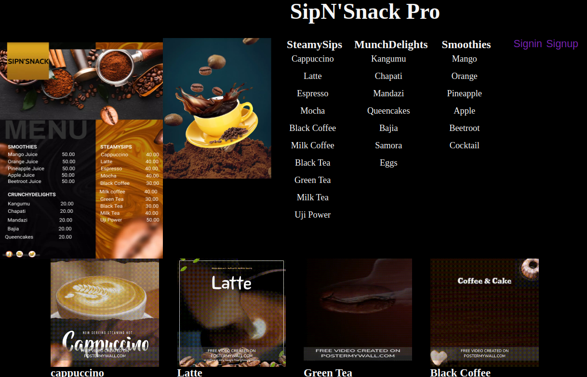

# Vending Machine Web Application
This is a simple vending machine web application built using JavaScript. It allows users to select and purchase various products, including hot drinks, juices, and snacks. The application also has an admin interface for managing products and viewing sales reports.

Public api: https://coffee.alexflipnote.dev/random.json

## Getting Started
To run this web application, follow these steps:

1. Clone the repository to your local machine:
git clone https://github.com/yourusername/SIPN-SNACK-PRO.git

2. Navigate to the project directory:
cd vending-machine-web-app

3. Open the index.html file in your web browser to access the vending machine interface.

## Features

### Display

#### Menu
- A menu on the far left with product prices so that user can know how much to pay
#### Overview
- The Display section consists of individual product cards, each displaying an image of the product, the product's name, and optional buttons for customer feedback. Here's a breakdown of the components in this section:

- Product Cards: Each product is presented in a separate card. The card includes an image of the product and its name. The images are in GIF format, providing an animated representation of the product.

- Product Names: Below each product's image, there is a descriptive name that identifies the product. This makes it easy for customers to understand what they are selecting.

#### Usage
- Product Selection: Customers can browse through the product cards to choose the item they want to purchase.

- Product Details: The animated GIFs provide a visual representation of the products, making it more engaging for customers.

### Customer Interface
- Product Selection: Customers can choose from different product categories, including hot drinks, juices, and snacks.

- Product Availability: The application checks if a selected product is available in sufficient quantity. If a product is out of stock, it notifies the customer.

- Payment: Customers can enter the number of coins of different denominations (KES 20, KES 10, KES 5) to make a payment. The application calculates the change if the payment is sufficient.

## Admin Interface
- Login: Admins can log in using their username and password to access admin features.

- Sales Report: Admins can view the total sales generated by the vending machine.

- Product Management: Admins can add new products to the vending machine, specifying the product name and quantity. They can also remove products from the machine.

## Usage
### Customer Usage
1. Open the web application in your browser.

2. Select a product category from the available options (hot drinks, juices, snacks).

3. Click on a product name to view details and make a purchase.

4. Enter the number of KES 20, KES 10, and KES 5 coins to make a payment.

5. Click the "Submit" button to complete the purchase.

6. Receive change if the payment is sufficient, and enjoy your product.

### Admin Usage
1. Log in with your username and password.

2. Access the following admin features:

- Sales Report: View the total sales generated.
- Product Management: Add new products or remove existing ones.
### Screenshots

## Technologies Used
- HTML
- CSS
- JavaScript
- JSON
- Markdown

## Authors
This project has been authored by John Ouma alias Ouma Arera

## License
This project is licensed under the MIT License - see the LICENSE.md file for details.